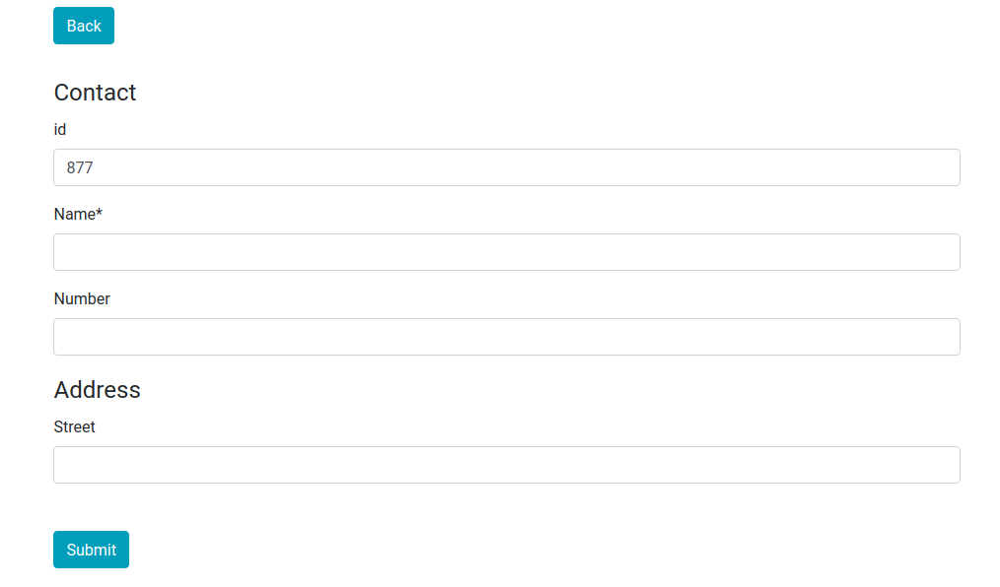
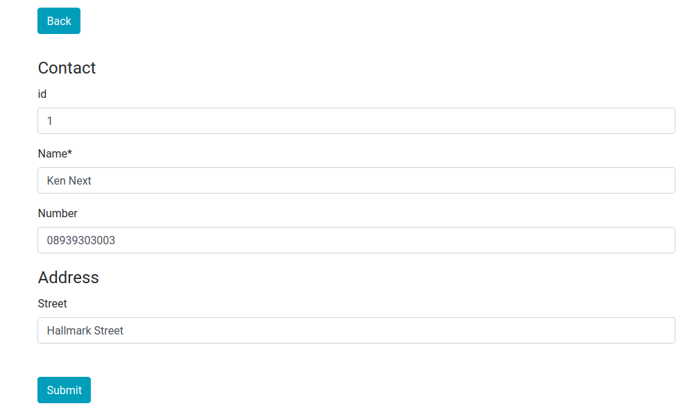
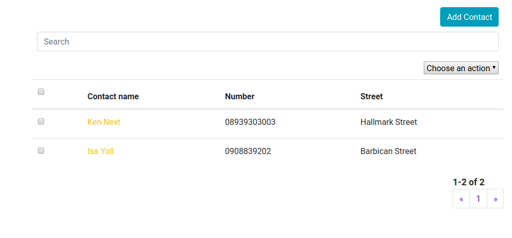
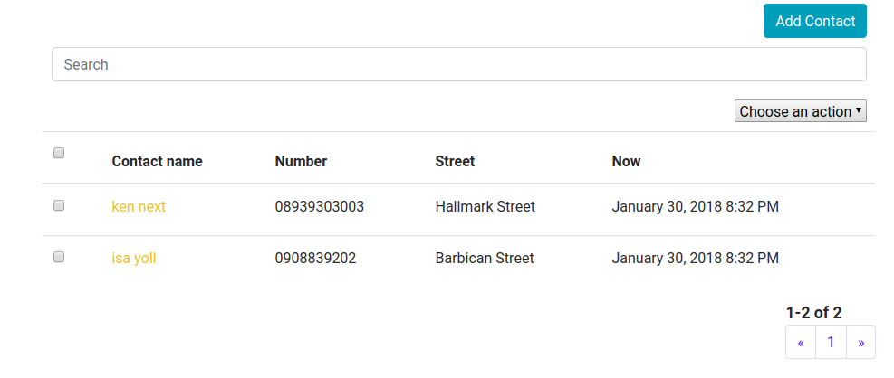

# react-crud-admin

**react-crud-admin** is inspired by the Django Admin Interface. In the spirit of Django admin it opts for component customization by inheritance. The create-read-update-delete pattern is something that is encountered in a lot of apps. By creating a single component that lists entries and allows adding/changing it becomes possible to implement a DRY approach.

Since React is primarily a UI library and there are a litany of  backends, **react-crud-admin** does not implement any backend specific features but allows the developer to provide custom implementations.

# Getting Started

## Installation

Install the library,

    npm install react-crud-admin

## Example

If you are starting a react project you can use **create-react-app** to speed up bootstrapping,

    npm install create-react-app
    npx create-react-app example
    cd example

then within the `example` directory,

    npm install react-crud-admin


Create a new file `example.js` in the `\src` folder, in that file add the following lines

```javascript
    import React from 'react';
    import Admin from "react-crud-admin";

    export default class Example extends Admin
    {
	constructor()
    	{
		super()
		this.name='Contact'; // name of the objects 
		this.name_plural='Contacts'; // name of the objects in plural
		this.list_display_links=['name']; // which property of the object is clickable
		this.list_display=['name','number','address.street']// a list of properties of the object to displayed on the list display page


	}
     }
    get_queryset()
    {
    	// the actual array containing objects to be displayed
	return [
	    {id: 1, name: 'Joe Next', number: '08939303003',address:{ street: "Hallmark Street"}},
            {id: 2,name: 'Isa Yoll', number: '0908839202',address:{ street: "Barbican Street"}}
	]
	    
    }

    }  
     
```

then in `index.js` do

```javascript

import React from 'react';
import ReactDOM from 'react-dom';
import Example from './example.js';

ReactDOM.render(<Example/>
    ,  document.querySelector("#app"))
```

The output in your browser should be


This is the list display view. At this point adding and editing objects will not be possible since we have not configured the add/change view. To do that we need to import the `react-jsonschema-form` package.

Edit `example.js` and add the following,

```javascript
import React from 'react';
import Admin from "./admin.js";
import Form from "react-jsonschema-form";
export default class Example extends Admin
{
    constructor()
    {
	super()
	this.name='Contact';
	this.name_plural='Contacts';
	this.list_display_links=['name'];
	this.list_display=['name','number','address.street']
    }
    get_queryset()
    {
	return [
	    {id: 1, name: 'Ken Next', number: '08939303003',address:{ street: "Hallmark Street"}},
            {id: 2,name: 'Isa Yoll', number: '0908839202',address:{ street: "Barbican Street"}}
	]
    }
    get_form(object=null)
    {
    	let schema = {
	    title: this.name,
	    type: "object",
	    required: ["name"],
	    properties: {
		id: {type: "number", title: "id", default: Math.floor(1000*Math.random())+1 },
		name: {type: "string", title: "Name", default: ""},
		number : {type: "string", title: "Number", default: ""},
		address : {type: "object", title: "Address",
		       properties : {
		              street : { type : "string",title : "Street"}
		        }
		    }
	    	 }
	    };
	    
	 if(!object)
	 {
		   return <Form schema={schema}  />
	 }
	 else
	 {
	        return <Form schema={schema}  formData={object}  />
	 }
     }

}

```

the `get_form` method is passed the current object. The method returns a `react-json-schema` `Form` component. The `schema` object is used to define a `schema` for the Form (and to provide validation). See more on `react-jsonschema-form` at [react-jsonschema-form](https://github.com/mozilla-services/react-jsonschema-form). You can also read more on JSON Schema at [JSON Schema Tutorial](https://spacetelescope.github.io/understanding-json-schema/)

In `get_form` we check if an object exists displaying a preloaded form if it does and an empty one if it does not.

The output in your browser after clicking the Add Contact button should be



The output in your browser after clicking the first contact's name should be




#Guide

##List Display View
###Data
Data is primarily injected through `get_queryset`.

```javascript
get_queryset()
    {
	return [
	    {id: 1, name: 'Ken Next', number: '08939303003',address:{ street: "Hallmark Street"}},
            {id: 2,name: 'Isa Yoll', number: '0908839202',address:{ street: "Barbican Street"}}
	]
    }
```

The `get_queryset` method returns the queryset array including objects to be displayed. Returning an array may not be useful when asynchronous network calls are made to a remote backend using AJAX or `window.fetch`.  A class method of the `Admin` component `set_queryset` can be used for asynchronous calls.

The example below returns the queryset in the current state object synchronously and sets a new queryset when the asynchronous call returns successfully. `set_queryset` invokes `setState` internally.

```javascript
get_queryset()
    {
	fetch("/path/to/backend",{method : 'get'}).then((response)=>{
		if(response.ok)
		{
			this.set_queryset(response.results);

	        }		

        })
	return this.state.queryset;
    }
```

###UI Customisation
#### Header Transforms
Table headers in the list display view are obtained from property names in `get_list_display` method by default. There are certain cases when one would like to customise these headers. `get_header_transforms` does just that. As an example

```javascript
get_header_transforms()
{
  return { 'name' : function(name)
  	                  {
                            
			    return 'Contact '+name	
                        }
              }
}
     

```
Should produce



Header transforms can be defined using the instance variable `header_transforms` (which is always overridden by `get_header_transforms`).

```javascript
this.header_transforms = { 'name' : function(name)
  	                    {
                            
			    return 'Contact '+name	
                            }
                          }

```

In summary `get_header_transforms` returns an object whose properties are field names corresponding to properties of any object in the queryset and whose values are transform functions.

#### Field Transforms
Field transforms return an object whose properties are field names corresponding to properties of any object in the queryset and whose values are transform functions. They are used to transform the values of objects within the queryset. For example to transform every "name" property of all the objects in the queryset to lower case we use,

```javascript
get_field_transforms()
{
	return { 'name' : function(content,object)
  	                  {
                              return content.toLowerCase()
                          }
               }
    }
```
or
```javascript
this.field_transforms ={ 'name' : function(content,object)
  	                  {
                              return content.toLowerCase()
                          }
                        }
```
This produces


All the contact names have been turned to lower case. Field transforms apply to full columns on the data table in the display view.
#### Extra Fields
It is sometimes desirable to create new fields that are not properties in any of the objects in the queryset. As an example, we create a new field that displays the current time using the `moment` library.
```javascript

get_extra_fields()
     {
      return { 'now' : function(object,label)
                        {
                           return moment(new Date()).format('LLL');
                         }
              }
     }
     

```
or somewhere in the constructor,

```javascript

this.extra_fields ={
		    'now' : function(object,label)
                  	      {
                                 return moment(new Date()).format('LLL');
                         }
              	    }

```

The `get_extra_fields` method returns an object whose properties are extra field names not corresponding to properties of any object in the queryset and whose values are display functions. This will create extra fields that are not tied to objects. Extra fields have to be manually included in the `get_list_display` in order to appear in the list display page.

Adding the `get_extra_fields` method is not enough to display the newly created field. We must add the field to `get_list_display`.

```javascript
this.list_display=['name','number','address.street','now']	
```

Don't forget to install moment with `npm install moment --save` and add `import moment from "moment"` at the top of the file. The output is,



#### 
#### Pagination
###Search
####Live Search
###Sorting
###Actions
##Add/Change View
###Forms
####Post Submit